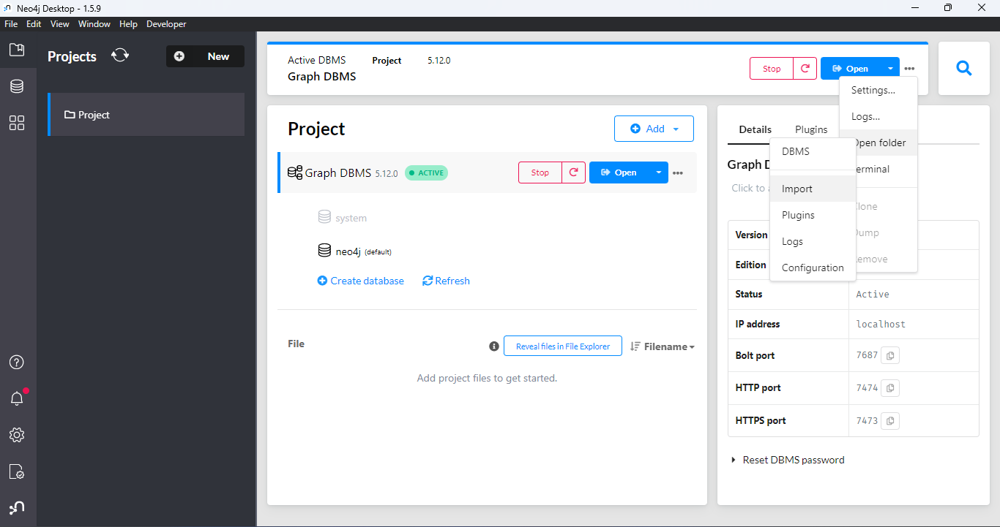
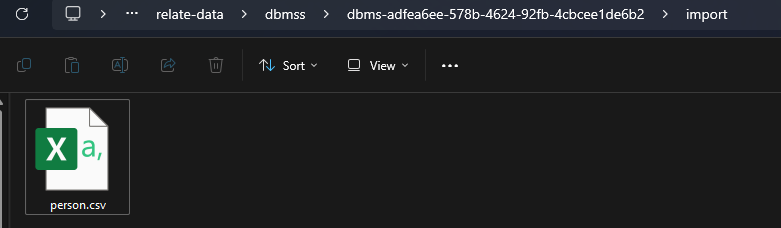
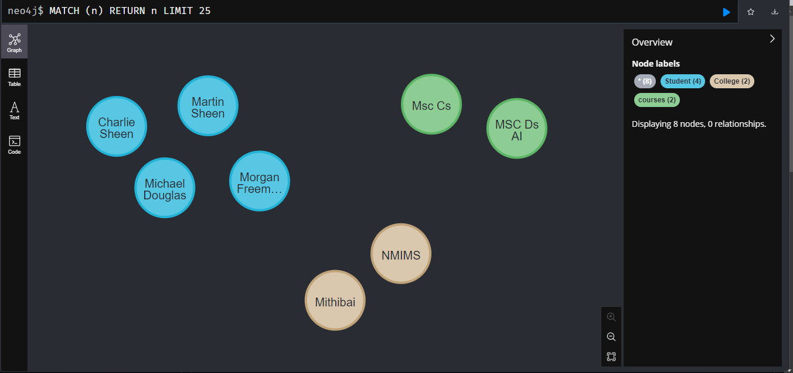
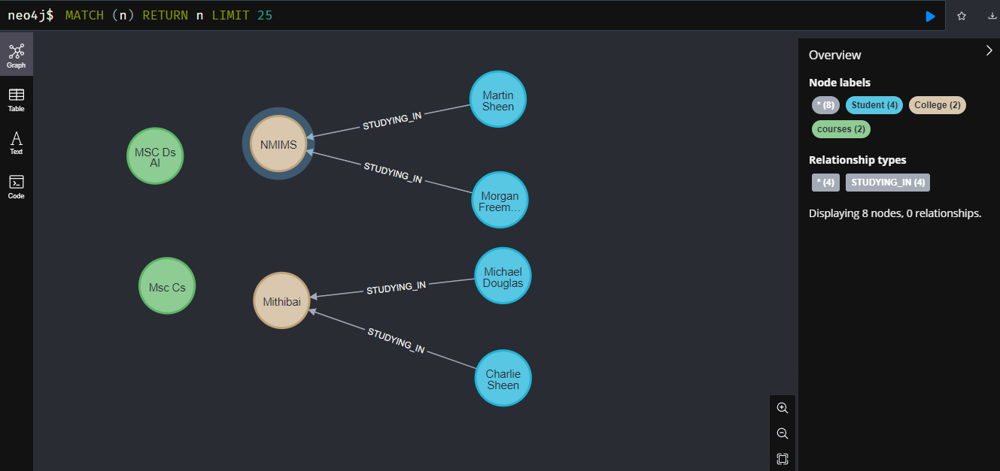
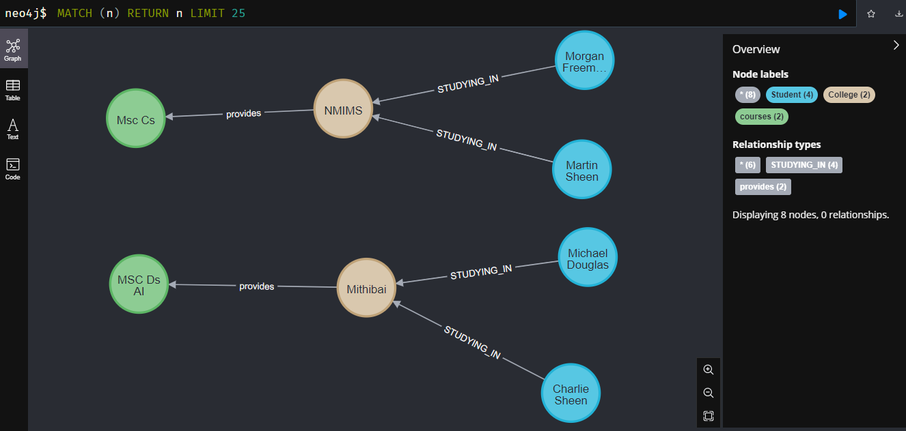
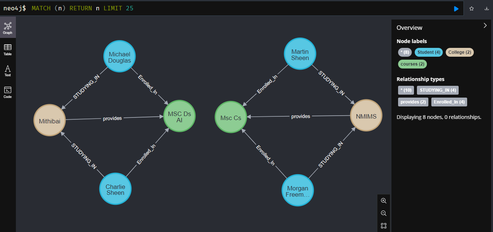

# Import Data from CSV and Create Nodes & Relationship
### *Note:* Click to Download  [`person.csv`](https://github.com/AsadCodeCraft/Neo4j/blob/main/person.csv)
## 1. Copy the CSV file in current project `import` Directory



## 2. Open Neo4j Browser & Run the Commands as below:
---

### 1. Create Nodes for Student, College & Courses

```javascript
LOAD CSV WITH HEADERS FROM 'file:///person.csv' AS row
CREATE (:Student {
    studentID: toInteger(row.studentID),
    name: row.Name,
    age: toInteger(row.Age)
})
MERGE (:College {name: row.College})
MERGE (:courses {name: row.offer})
```


### 2. Creating Relationship between Student & College Nodes
```javascript
LOAD CSV WITH HEADERS FROM 'file:///person.csv' AS row
MATCH (student:Student {name: row.Name})
MATCH (college:College {name: row.College})
MERGE (student)-[:STUDYING_IN]->(college)
```


### 3. Creating Relationship between College & Courses offered by the college 
```javascript
LOAD CSV WITH HEADERS FROM 'file:///person.csv' AS row
MATCH (courses:courses  {name: row.offer})
MATCH (college:College {name: row.College})
MERGE (college)-[:provides]->(courses)
```


### 4. Creating Relationship between Student & Courses Enrolled
```javascript
LOAD CSV WITH HEADERS FROM 'file:///person.csv' AS row
MATCH (c:Student {name: row.Name})
MATCH (en:courses {name: row.offer})
MERGE (c)-[:Enrolled_In]->(en)
```


